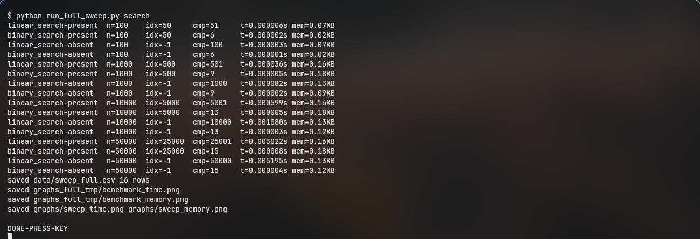
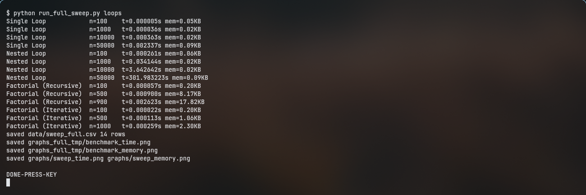
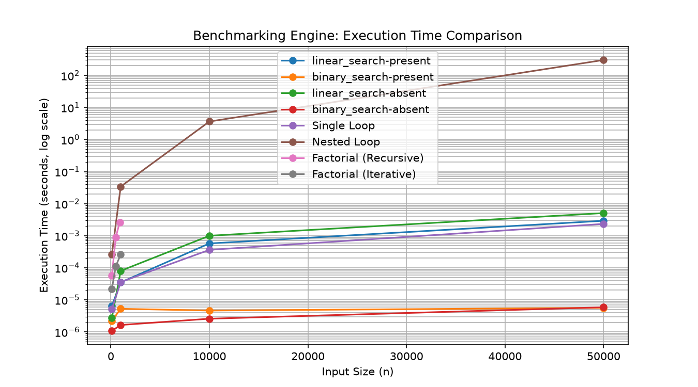
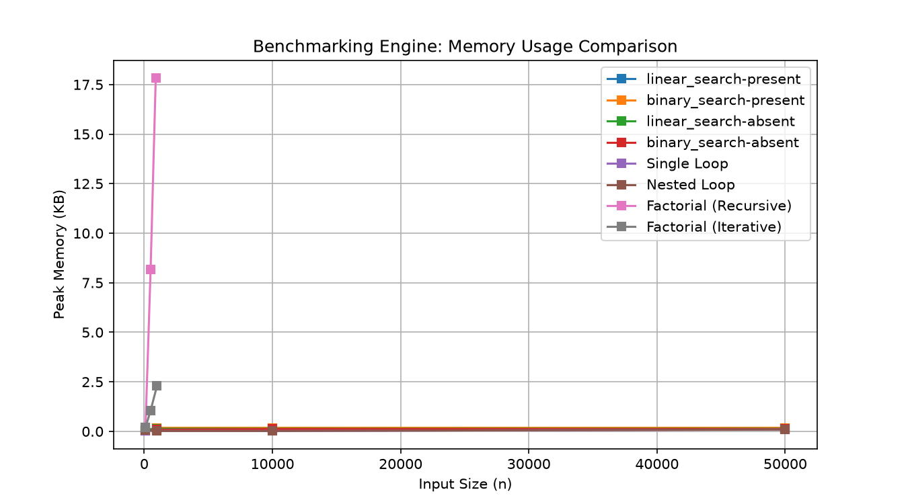

<div style="text-align: center;"></div>

<hr>

<div style="text-align: center;">
<h1>K.R. Mangalam University</h1>
<h3>School of Engineering and Technology</h3>
<h3>LAB 2 BENCHMARKING REPORT</h3>
<p>Program: BCA (AI & DS)<br>Course Code - ENCA351 (2026-27)</p>
</div>

<table class="front">
<tr>
<td><strong>Submitted by:</strong><br>Name: Priyanshu Mishra <br>Roll Number: 2401201161 <br>Course: BCA (AI & DS) - Section A</td>
<td style="text-align: right;"><strong>Submitted To:</strong><br>Dr. Aarti<br>Faculty, SOET</td>
</tr>
</table>

<div style="page-break-before: always;"></div>

<style>pre { font-size: 10px; } table { font-size: 12.5px; break-inside: avoid; } th, td { padding: 5px 10px; } table.front, table.front td { border: none; }</style>

## 1. Introduction

An algorithm that is fast on small inputs can collapse on large ones,
so performance measurement is done before deployment, not after.
This lab builds one reusable benchmarking tool (execution time via
`time.perf_counter`, memory via `tracemalloc`) and applies it to Linear
and Binary Search plus four code patterns (single loop, nested loop,
recursive and iterative factorial), comparing theory against measurement
as input sizes grow.

## 2. Modules

### 2.1 Search lab

Linear Search scans every element (works unsorted). Binary Search halves
a sorted interval each step. Both return `(index, comparisons)`.

search_analysis.py:

```python
"""Q2 search module: Linear + Binary Search with comparisons, time, memory."""
import time
import tracemalloc


def linear_search(arr, target):
    """Scan sequentially. Returns (index, comparisons). Works on unsorted data."""
    comparisons = 0
    for i, value in enumerate(arr):
        comparisons += 1
        if value == target:
            return i, comparisons
    return -1, comparisons


def binary_search(arr, target):
    """Halve a SORTED list. Returns (index, comparisons). Iterative, O(1) space."""
    comparisons = 0
    low, high = 0, len(arr) - 1
    while low <= high:
        mid = (low + high) // 2
        comparisons += 1
        if arr[mid] == target:
            return mid, comparisons
        elif arr[mid] < target:
            low = mid + 1
        else:
            high = mid - 1
    return -1, comparisons


def measure_search(func, arr, target):
    """Run one search, return dict with result, comparisons, time, memory."""
    tracemalloc.start()
    start = time.perf_counter()
    index, comparisons = func(arr, target)
    elapsed = time.perf_counter() - start
    _, peak = tracemalloc.get_traced_memory()
    tracemalloc.stop()
    return {
        "index": index,
        "comparisons": comparisons,
        "time_sec": elapsed,
        "memory_kb": peak / 1024,
    }


def make_dataset(n, key="present"):
    """Sorted dataset 0..n-1 plus a key. key='present' (middle) or 'absent' (-1)."""
    data = list(range(n))
    target = n // 2 if key == "present" else -1
    return data, target


if __name__ == "__main__":
    for target in (500, -1):
        data, _ = make_dataset(1000)
        for func in (linear_search, binary_search):
            r = measure_search(func, data, target)
            print(f"{func.__name__:14s} key={target:4d} -> index={r['index']:4d} "
                  f"comparisons={r['comparisons']:4d} time={r['time_sec']:.6f}s "
                  f"mem={r['memory_kb']:.2f}KB")
```

### 2.2 Code patterns

Single loop sums once (O(n)), nested loop counts pairs (O(n^2)),
factorials recurse or accumulate (O(n) time, O(n) vs O(1) space).

code_benchmark.py:

```python
"""Q3 code benchmarking module: loop and factorial patterns + measurement."""
import time
import tracemalloc


def single_loop(n):
    """Sum 0..n-1 with one loop. O(n) time, O(1) space."""
    total = 0
    for i in range(n):
        total += i
    return total


def nested_loop(n):
    """Count all (i, j) pairs with a nested loop. O(n^2) time, O(1) space."""
    total = 0
    for i in range(n):
        for j in range(n):
            total += 1
    return total


def factorial_recursive(n):
    """n! via recurrence n! = n * (n-1)!. O(n) time, O(n) stack space."""
    if n <= 1:
        return 1
    return n * factorial_recursive(n - 1)


def factorial_iterative(n):
    """n! via accumulator loop. O(n) time, O(1) space."""
    result = 1
    for i in range(2, n + 1):
        result *= i
    return result


def benchmark_snippet(func, *args):
    """Run one snippet, return dict with result, time, memory."""
    tracemalloc.start()
    start = time.perf_counter()
    result = func(*args)
    elapsed = time.perf_counter() - start
    _, peak = tracemalloc.get_traced_memory()
    tracemalloc.stop()
    return {"result": result, "time_sec": elapsed, "memory_kb": peak / 1024}


if __name__ == "__main__":
    for func, arg in ((single_loop, 10000), (nested_loop, 500),
                      (factorial_recursive, 20), (factorial_iterative, 20)):
        r = benchmark_snippet(func, arg)
        print(f"{func.__name__:20s} n={arg:<6d} time={r['time_sec']:.6f}s "
              f"mem={r['memory_kb']:.2f}KB")
```

### 2.3 Automated engine

One engine runs any function across sizes and records time plus memory.

benchmark_engine.py:

```python
"""Q4 automated benchmarking engine: any func across input sizes."""
import time
import tracemalloc


class BenchmarkEngine:
    """Runs a function across multiple input sizes, records time + memory."""

    def __init__(self):
        self.results = []   # list of dicts: {algorithm, input_size, time, memory}

    def run(self, func, input_sizes, name=None, arg_builder=lambda n: (n,)):
        """Benchmark func at each size. arg_builder(n) -> args tuple."""
        algo_name = name or func.__name__
        for n in input_sizes:
            args = arg_builder(n)
            tracemalloc.start()
            start = time.perf_counter()
            func(*args)
            elapsed = time.perf_counter() - start
            _, peak = tracemalloc.get_traced_memory()
            tracemalloc.stop()
            self.results.append({
                "algorithm": algo_name,
                "input_size": n,
                "time_sec": elapsed,
                "memory_kb": peak / 1024,
            })
        return self

    def as_dataframe(self):
        import pandas as pd
        return pd.DataFrame(self.results)


if __name__ == "__main__":
    from search_analysis import linear_search, binary_search
    from code_benchmark import (single_loop, nested_loop,
                                factorial_recursive, factorial_iterative)

    engine = BenchmarkEngine()
    sizes = [100, 500, 1000, 2000]
    engine.run(single_loop, sizes, name="Single Loop")
    engine.run(nested_loop, sizes, name="Nested Loop")
    engine.run(factorial_recursive, [100, 500, 900], name="Factorial (Recursive)")
    engine.run(factorial_iterative, sizes, name="Factorial (Iterative)")
    engine.run(linear_search, sizes, name="Linear Search",
               arg_builder=lambda n: (list(range(n)), -1))
    engine.run(binary_search, sizes, name="Binary Search",
               arg_builder=lambda n: (list(range(n)), -1))
    df = engine.as_dataframe()
    print(df.to_string(index=False))
    df.to_csv("benchmark_results.csv", index=False)
    print("saved benchmark_results.csv")
```

The full sweep driver is run_full_sweep.py (`search`, `loops`, or `all`
parts); charts come from visualize.py into graphs/.

### 2.4 Interactive app

app.py (Streamlit, four tabs: Search Lab, Code Benchmark, Auto Benchmark,
Complexity Table) wires the same modules to widgets: dataset slider and
key input for search, snippet select plus n slider for patterns, one-click
full sweep with dataframe plus time chart, and the static complexity table.

<div style="page-break-before: always;"></div>

## 3. Results

Single measured runs on Linux/Python 3.14. Recursive factorial stops at
n=900 (n=1000 exceeds the default recursion limit); everything else runs
the brief sizes.

### 3.1 Search (comparisons, time, memory)

| n | Case | Linear cmp | Linear time (s) | Binary cmp | Binary time (s) |
|---|---|---|---|---|---|
| 100 | present | 51 | 0.000006 | 6 | 0.000002 |
| 100 | absent | 100 | 0.000003 | 6 | 0.000001 |
| 1000 | present | 501 | 0.000035 | 9 | 0.000005 |
| 1000 | absent | 1000 | 0.000081 | 9 | 0.000002 |
| 10000 | present | 5001 | 0.000574 | 13 | 0.000005 |
| 10000 | absent | 10000 | 0.000999 | 13 | 0.000003 |
| 50000 | present | 25001 | 0.002927 | 15 | 0.000006 |
| 50000 | absent | 50000 | 0.005086 | 15 | 0.000006 |

Memory stays under 0.2KB for both: searching allocates nothing beyond
the input. Binary comparisons grow 6, 9, 13, 15 - doubling digits while
linear counts track n.



### 3.2 Factorial

| n | Recursive time (s) | Recursive mem (KB) | Iterative time (s) | Iterative mem (KB) |
|---|---|---|---|---|
| 100 | 0.000057 | 0.20 | 0.000022 | 0.20 |
| 500 | 0.000900 | 8.17 | 0.000113 | 1.06 |
| 900 / 1000 | 0.002623 (n=900) | 17.82 | 0.000259 (n=1000) | 2.30 |

Recursion pays in both columns: ~10x slower and ~8x more memory at
n=500, because every level holds a stack frame plus (here) a growing
tracemalloc peak, while the loop holds one accumulator.

### 3.3 Loops

| n | Single time (s) | Nested time (s) | Ratio |
|---|---|---|---|
| 100 | 0.000005 | 0.000261 | 52x |
| 1000 | 0.000036 | 0.034144 | 949x |
| 10000 | 0.000363 | 3.642642 | 10034x |
| 50000 | 0.002337 | 301.983223 | 129195x |

Single loop scales with n (0.0023s at 50k). Nested loop follows n^2:
10x more input costs ~100x more time, reaching 302 seconds at 50k while
memory stays flat (0.09KB) - time, not space, is the wall.



<div style="page-break-before: always;"></div>

## 4. Complexity table

| Algorithm / Pattern | Best | Average | Worst | Space |
|---|---|---|---|---|
| Linear Search | O(1) | O(n) | O(n) | O(1) |
| Binary Search | O(1) | O(log n) | O(log n) | O(1) |
| Single Loop | O(n) | O(n) | O(n) | O(1) |
| Nested Loop | O(n^2) | O(n^2) | O(n^2) | O(1) |
| Factorial (Recursive) | O(n) | O(n) | O(n) | O(n) |
| Factorial (Iterative) | O(n) | O(n) | O(n) | O(1) |

## 5. Visualizations

Time axis is log-scale (10^-6 to 10^2 seconds); memory is linear.
Nested Loop's curve leaves every other pattern behind, binary search
stays flat, and recursive factorial's memory climbs while iterative
stays level.





## 6. Analysis

Binary Search beats Linear everywhere measured (at 50k absent: 15
comparisons and 6 microseconds vs 50000 comparisons and 5 milliseconds,
~800x faster) because halving beats scanning; the price is sorted input.
Recursive factorial loses to iterative on both axes (10x time, 8x memory
at n=500) with identical results - stack frames cost real time and
space, and the recursion ceiling caps n below 1000. Single vs nested
loop is the sharpest lesson: same O(1) memory, but 50k inputs take
0.002s vs 302s, so nesting depth decides feasibility, not memory.
Theory matches measurement throughout: linear counts track n, binary
counts track log2(n) (6, 9, 13, 15), nested time tracks n^2.

## 7. Conclusion

Measure before deploying: binary search for sorted data, iterative
factorial always, and never nest loops over large inputs. The engine,
notebook, and app reuse the same measurement path, so every number in
this report regenerates from one command.

<div style="page-break-before: always;"></div>

## 8. How to reproduce

```bash
python search_analysis.py && python code_benchmark.py && python benchmark_engine.py
python run_full_sweep.py all && python visualize.py
```

Launch the interactive app with `streamlit run app.py`.

Executed live for this report:

- Module demos: binary 9 vs linear 501 comparisons at n=1000 present.
- `run_full_sweep.py search` plus `loops`: 30-row `data/sweep_full.csv`,
  nested-50k measured twice (302s, 283s).
- `visualize.py` plus full-data replot: log-scale `sweep_time.png`.
- `project_notebook.ipynb`: executes 3/3 cells, zero errors.
- Streamlit `app.py`: serves HTTP 200 headless.
